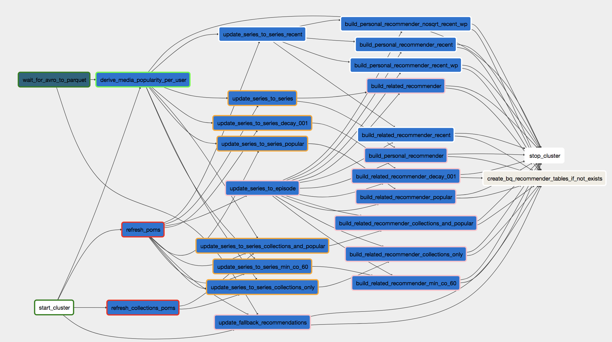
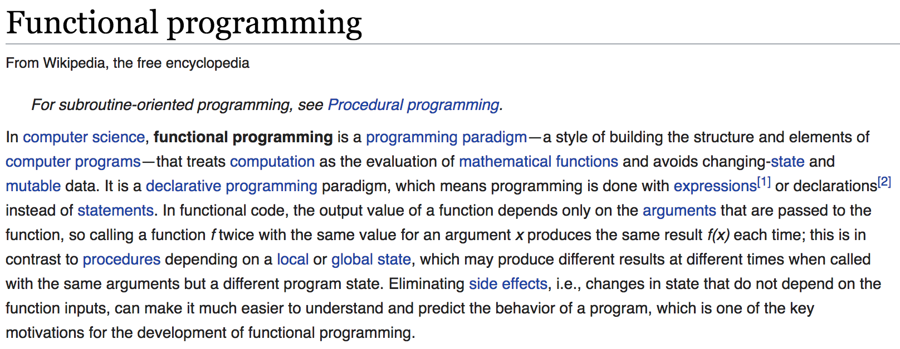
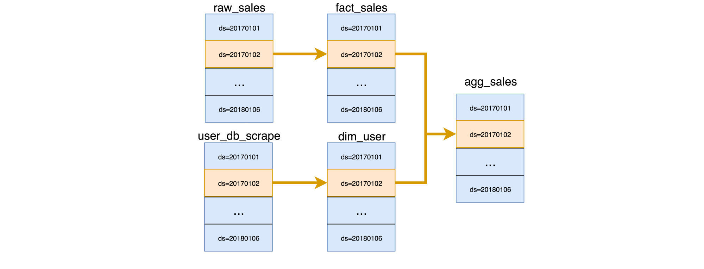
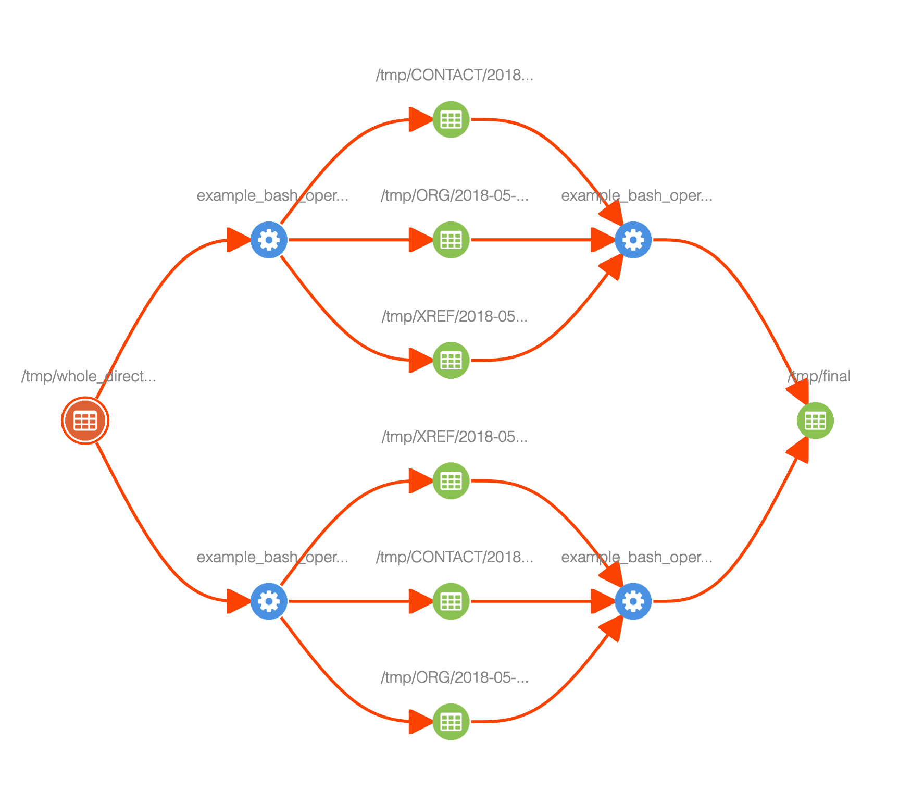
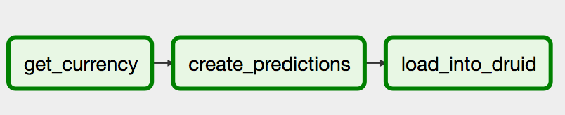
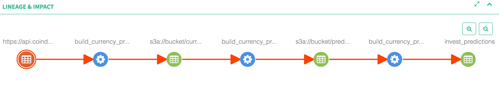

autoscale: true


# PyData 2018

# Amsterdam

## Elegant data pipelining with Apache Airflow

---

# Apache Airflow (incubating)


- Programmatically task based workflow scheduling
- Developed by Airbnb in 2015, moved to Apache in 2016
- {ETL, Machine Learning, Predictive, General} pipeline
- Used by 120+ companies, including Airbnb, ING, Lyft, LinkedIn, Paypal, Reddit and more
- 462 contributors and growing
- We love open source

---

# About us

 - Fokko Driesprong (fokko@apache.org), Data Engineer at GoDataDriven and Apache Airflow Committer
 - Bolke de Bruin (bolke.de.bruin@ing.com), Apache Airflow Committer, CTO Wholesale Banking Advanced Analytics

---

# Why is this important

- ETL consists of a complex network of dependencies
- Analytics and batch processing is mission critical
- Too much time is spend on monitoring and troubleshooting jobs

---



---

# What does elegant mean?

- Reproducible: idempotent tasks and data
- Future proof: backfilling, versioning
- Robust against changes: easy changes to DAGs, e.g. adding, removing or changing tasks
- Clarity: transparency where data resides, what it means and where it flows

^ Imagine you are using machine learning models that need conversion rates for currencies. This you then use for advice to your customers. For your business it is important that you are able to explain to your customer how you got to a certain decision. In your data pipelines this means even more emphasis on reproducibility and replicability which require idempotency of your tasks.

---

# Functional Programming



---

# Transformations as a pure function

Model the operation as a mathematical function:

$$
f(x) \rightarrow y
$$

- Defined input and output
- No side effects
- Easier to reason about and (unit) test

^ By setting up a contract of the function, the output can be easily asserted based on a given input. Avoid external state and mutable data so it can be tested and reasoned about in isolation. This should give a determinstic and idempotent building block for your DAG. A specific version of the code, should give the same result.

---

# Side effects

For example, good:

```python
def pure_add_one(i):
  return 1 + i
```

Bad:

```python
counter = 0
def impure_add_one(i):
  counter += 1
  return counter  
```

---

# Avoid external state

```python
good_current_currency = SimpleHttpOperator(
    task_id='get_currency',
    endpoint='https://api.coindesk.com/v1/bpi/historical/close.json?
    start={{ ds }}&end={{ ds }}',
    dag=dag
)
```

```python
bad_current_currency = SimpleHttpOperator(
    task_id='get_currency',
    endpoint='https://api.coindesk.com/v1/bpi/currentprice.json',
    dag=dag
)
```

---

# Be idempotent in your actions

Good:

```sql
UPDATE users SET active = false
```

Bad:

```sql
UPDATE users SET active = NOT active
```

---

# Be immutable

- Never append, but overwrite the partition
- Easier to parallelise

```sql
INSERT OVERWRITE TABLE crypto
    PARTITION(day='{{ ds }}')
SELECT
    w.address    address,
    w.currency   currency
    w.btc        btc,
    r.usd        usd
FROM wallet w
JOIN currency_exchange_rates r USING(currency)
WHERE day = '{{ ds }}'
```

---

# Future proof templated (from 1.10+)	+

```
{{ set table = outlets['table'] }}
{{ set w = inlets['wallet'] }}
{{ set r = inlets['currency_exchange_rates'] }}
```
```sql
INSERT OVERWRITE TABLE {{ table.name }}
    PARTITION(day='{{ ds }}')
SELECT
    {{ w.address }}   {{ table.address }},
    {{ w.currency }}  {{ table.currency }}
    {{ w.btc }}       {{ table.btc }},
    {{ r.usd }}       {{ table.usd }}
FROM {{ w.name }}
JOIN {{ r.name }} USING({{ table.currency }})
WHERE day = '{{ ds }}'
```

---


---

# Changing the code over time

- Previously DAG runs can be repeated with new code.
- Data can be repaired by rerunning the new code, either by clearing tasks or doing backfills.
- Reproducibility is critical
  - Legal standpoint
  - To keep sane

---

# Clarity by Lineage

Answers the following questions for a developer

- What is the latest version of the data I need?
  So I need to save versions of my data? Yes!  
      ```outlet = Table(max_versions=5)```

- Where did I get the data from?

- We need to store this somewhere (e.g. Apache Atlas or something else)

---


 
---

## Bringing it together
Our DAG consists of 3 tasks
1. Download currency rate data from the web
2. Run our Machine Learning model that is using Spark
3. Drop the data in Apache Druid for OLAP

```python
args = {'start_date': airflow.utils.dates.days_ago(2)}
dag = DAG(
    dag_id='build_currency_preditions', default_args=args,
    schedule_interval='0 0 * * *')
```

---

## Downloading the currency data
```python
inlet = File("https://api.coindesk.com/v1/bpi/historical"
             "/close.json?start={{ execution_date }}"
             "&end={{ execution_date }}")
outlet = File("s3a://bucket/currency_rates.{{ execution_date }}"
              ".{{ version }}", max_versions=5)
op1 = SimpleHttpOperator(dag=dag, task_id="get_currency",
                         inlets={"datasets": [inlet,]},
                         outlet={"datasets": [outlets,]})
```

---

## Run Machine Learning model
```python
outlet = File("s3a://bucket/prediction.{{ execution_date }}."
              "{{ version }}", max_versions=5)
op2 = SparkSubmitOperator(dag=dag,
                          task_id="create_predictions",
                          inlets={"auto": True},
                          outlets={"datasets": [outlet,]},
                          application="create_currency_predictions")
op2.set_upstream(op1)
```

---

## Drop the data into Druid
```python
outlet = Table("invest_predictions", max_versions=5)
op3 = DruidOperator(dag=dag,
                    task_id="load_into_druid",
                    inlets={"auto": True},
                    outlets={"datasets": [outlet,])
op3.set_upstream(op2)
```

---

## The result



---
# Conclusion

Build data pipelines that:

- are idemptotent;
- are determinstic;
- have no side-effects;
- use-immutable sources and destinations;
- don't do update, upsert, append or delete

---

# Thank you!
# We are hiring!
### bolke.de.bruin@ing.com
### fokkodriesprong@godatadriven.com
